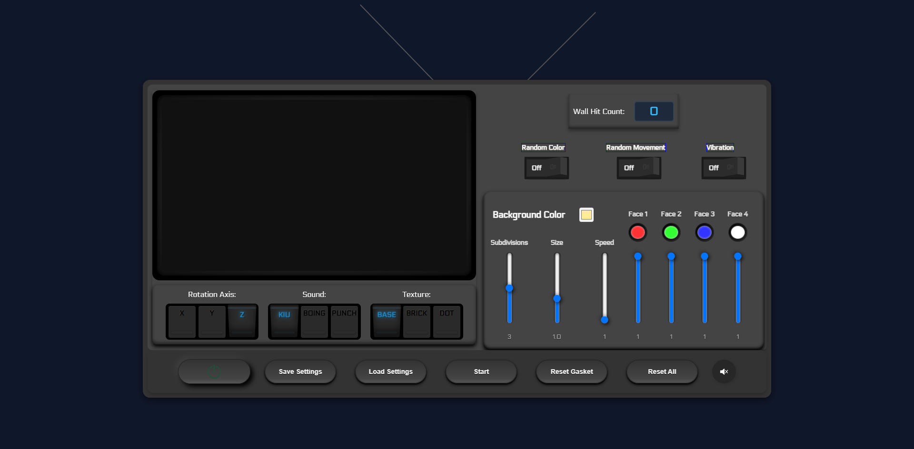
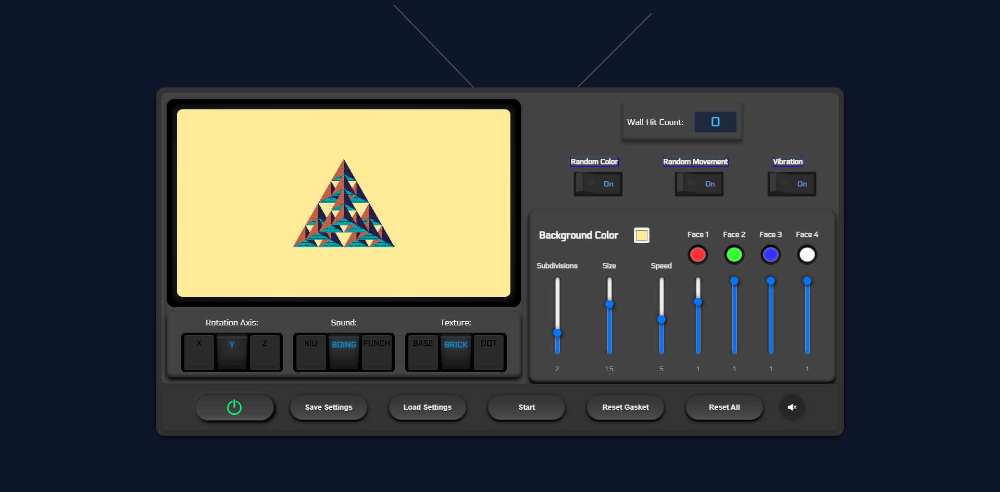

# **CPC 354 Assignment 1: Interactive 3D TV Interface**

This project is a creative 3D WebGL-based TV Ident featuring a dynamic interactive UI, animations, and customizable settings. Designed as part of an academic assignment, it showcases teamwork, technical expertise, and innovation.

## Features

- **3D TV Ident**: A visually engaging TV screen with animations.
- **Interactive Controls**: Adjust settings such as rotation axis, textures, and face colors.
- **Power Toggle**: Turn the TV on/off to access additional features.
- **Responsive Design**: Smooth animations and real-time updates.

## Technologies

- **HTML5**:
  - Structure of the TV interface and buttons.
- **CSS3**:
  - Styling for the TV components, buttons, animations, and popup reminder.
- **JavaScript**:
  - Logic for WebGL rendering, button interactivity, and TV state management.
- **WebGL**:
  - Rendering the 3D Sierpinski gasket object.

## How to Use

1. Turn on the TV using the power toggle.
2. Customize settings or start animations via the controls.
3. Save and load configurations as needed.

## **Screenshots**

1. **TV Off State**:
   

2. **TV On State**:
   

3. **Quick demo of the TV interface in action**:
   

## Live Demo

- **Test it out**: [Live Demo](https://jackychung2003.github.io/CPC354_Assignment_1/)

---

Enjoy exploring the dynamic world of 3D TV visuals!
